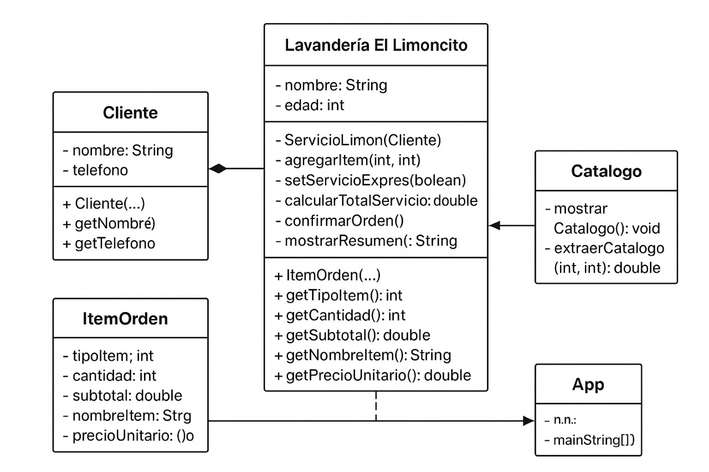

# Lavandería “El Limoncito”

Cada tarde, El Limoncito recibe clientes que dejan su ropa para recoger el mismo día. El módulo debe registrar nombre y teléfono del cliente y crear una orden con ítems de un catálogo fijo de hoy: Camisa ($4.000, o $3.500 c/u si dejan 5 o más), Pantalón ($6.000, o $5.000 c/u desde 5), y Chaqueta ($9.000, o $7.500 c/u desde 5). El cliente puede marcar la opción “servicio exprés”, que agrega un recargo del 10% al total. El cálculo debe hacerse así: primero subtotales por ítem usando precio por volumen cuando aplique; luego sumar para obtener el total bruto; si es exprés, agregar el 10%; al final, si el total resultante supera $60.000, aplicar descuento del 5% (una sola vez). No se permiten cantidades ≤ 0 ni totales negativos. Al confirmar la orden, no se puede editar y se debe generar un resumen claro (cliente, detalle con precio aplicado, total bruto, recargo, descuento y total final). No hay pagos ni inventario: solo tomar la orden, calcular y confirmar para agilizar la entrega.

----ANALISIS-----

----REQUERIMIENTOS FUNCIONALES---

1.crear un cliente con nombre y telefono.

2.crear una orden de items con el catalogo fijo.

3.agregar un 10% al total final si la opcion expres. 

4.el calculo se debe manejar de la siguiente manera primero los subtotales por item usando precio cuando aplique luego suma para obtener el total bruto y si se agrega la opcion expres se hace lo que esta dice.

5.agregar un 5% de descuento si la compra supera los $60.000 esto solo se puede hacer una vez.

----CRITERIOS DE ACEPTACION----

1.no se aceptan cantidades <= a 0.

2.no se permiten totales negativos.

3.no se puede editar una orden una vez confirmada.

----REGLAS DE NEGOCIO----

1.en camisa si dejan 5 o mas de 5 el valor es de $3.500 c/u, en pantalon si dejan mas de 5 o mas el valor es de $5.000 c/u y en el caso de chaqueta si se dejan 5 o mas el valor es de $7.500 c/u.

2.el cliente al marcar la opcion "servicio exprés" agrega el recalrgo al total final.

3.lel calculo del total es: primero subtotales de item por volumen cuando se aplique - sumar para el total bruto - si es exprés agregar el 10% - si el resultado final es superior a 60.000 se debe aplicar un descuento de 5%.

----LIMITE DE DISEÑO----

1.Cliente :

esta clase se va encargar de recibir el nombre y el telefon ode cliente.

2.Catalogo :

esta clase va a tener un metodo que nos va a servir para incluir el catalogo y las reglas del catalogo, otro metodo que muestre el catalogo.

3.ServicioLimoncito :

esta clase va a tener dos metodos, el primero se encargara de calcular el total de servicio y el segundo mostrara el resumen.

4.ItemOrden :

esta clase va a tener todas las caracterisiticas de la orden

----PRUEBAS----

1.se provara ingrsando una cantidad <= a 0 

2.se provara con totales negativos 

3.se provara que cuando el cliente de la opcion exprés se le agregue un recargo del 10%

4.se provara ingresando cantidades >= 5 para comprovar que se haga el descuento

----DISEÑO----

